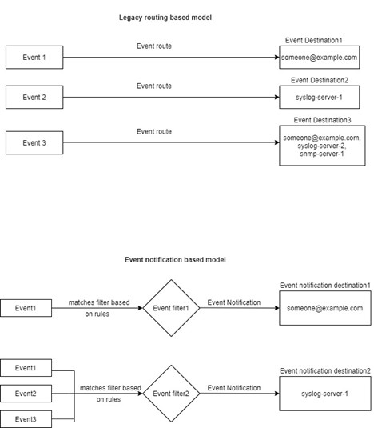

= Saiba mais sobre os modelos de mapeamento de eventos do ONTAP EMS
:allow-uri-read: 
:icons: font
:imagesdir: ../media/

[role="lead"]
Antes do ONTAP 9.0, os eventos EMS só podiam ser mapeados para destinos de eventos com base na correspondência do padrão de nomes de eventos. Os conjuntos de comandos ONTAP (`event destination`, `event route` ) que utilizam este modelo continuam a estar disponíveis nas versões mais recentes do ONTAP, mas foram obsoletos a partir do ONTAP 9.0.

A partir do ONTAP 9.0, a melhor prática para o mapeamento de destino de eventos do ONTAP EMS é usar o modelo de filtro de eventos mais dimensionável no qual a correspondência de padrões é feita em vários campos, usando os `event filter` conjuntos de comandos , `event notification` e `event notification destination` .

Se o mapeamento EMS estiver configurado usando os comandos obsoletos, você deverá atualizar o mapeamento para usar os `event filter` conjuntos de comandos , `event notification` e `event notification destination` . Saiba mais sobre `event` o link:https://docs.netapp.com/us-en/ontap-cli/search.html?q=event["Referência do comando ONTAP"^]na .

Existem dois tipos de destinos de eventos:

. *Destinos gerados pelo sistema*: Existem cinco destinos de eventos gerados pelo sistema (criados por padrão)
+
** `allevents`
** `asup`
** `criticals`
** `pager`
** `traphost`
+
Alguns dos destinos gerados pelo sistema são para fins especiais. Por exemplo, o destino asup encaminha os eventos callhome.* para o módulo AutoSupport no ONTAP para gerar mensagens AutoSupport.

. *Destinos criados pelo usuário*: Estes são criados manualmente usando o `event destination create` comando.
+
[listing]
----
cluster-1::event*> destination show
                                                                 Hide
Name             Mail Dest.        SNMP Dest.         Syslog Dest.       Params
---------------- ----------------- ------------------ ------------------ ------
allevents        -                 -                  -                  false
asup             -                 -                  -                  false
criticals        -                 -                  -                  false
pager            -                 -                  -                  false
traphost         -                 -                  -                  false
5 entries were displayed.
+
cluster-1::event*> destination create -name test -mail test@xyz.com
This command is deprecated. Use the "event filter", "event notification destination" and "event notification" commands, instead.
+
cluster-1::event*> destination show
+                                                                     Hide
Name             Mail Dest.        SNMP Dest.         Syslog Dest.       Params
---------------- ----------------- ------------------ ------------------ ------
allevents        -                 -                  -                  false
asup             -                 -                  -                  false
criticals        -                 -                  -                  false
pager            -                 -                  -                  false
test             test@xyz.com      -                  -                  false
traphost         -                 -                  -                  false
6 entries were displayed.
----

No modelo obsoleto, os eventos EMS são mapeados individualmente para um destino usando o `event route add-destinations` comando.

[listing]
----
cluster-1::event*> route add-destinations -message-name raid.aggr.* -destinations test
This command is deprecated. Use the "event filter", "event notification destination" and "event notification" commands, instead.
4 entries were acted on.

cluster-1::event*> route show -message-name raid.aggr.*
                                                               Freq    Time
Message                          Severity       Destinations   Threshd Threshd
-------------------------------- -------------- -------------- ------- -------
raid.aggr.autoGrow.abort         NOTICE         test           0       0
raid.aggr.autoGrow.success       NOTICE         test           0       0
raid.aggr.lock.conflict          INFORMATIONAL  test           0       0
raid.aggr.log.CP.count           DEBUG          test           0       0
4 entries were displayed.
----
O novo e mais escalável mecanismo de notificações de eventos EMS baseia-se em filtros de eventos e destinos de notificação de eventos. Consulte o seguinte artigo da KB para obter informações detalhadas sobre o novo mecanismo de notificação de eventos:

* link:https://kb.netapp.com/Advice_and_Troubleshooting/Data_Storage_Software/ONTAP_OS/FAQ%3A_Overview_of_Event_Management_System_for_ONTAP_9["Visão geral do sistema de gerenciamento de eventos para ONTAP 9"^]

