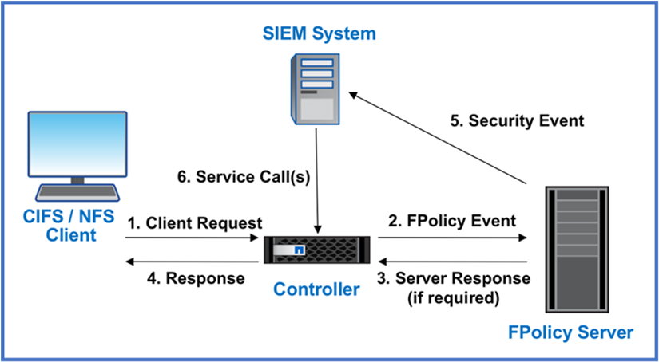

= Projete uma abordagem centrada em dados para zero confiança com o ONTAP
:allow-uri-read: 
:icons: font
:imagesdir: ../media/

[role="lead"]
Uma rede Zero Trust é definida por uma abordagem centrada em dados, na qual os controles de segurança devem estar o mais próximos possível dos dados. As funcionalidades do ONTAP, somadas ao ecossistema parceiro do NetApp FPolicy, podem fornecer os controles necessários para o modelo de confiança zero centrado em dados.

O ONTAP é um software de gerenciamento de dados seguro da NetApp, e o mecanismo de confiança zero da FPolicy é um recurso ONTAP líder do setor que oferece uma interface de notificação granular com eventos baseados em arquivo. Os parceiros do NetApp FPolicy podem usar essa interface para fornecer mais informações sobre o acesso aos dados no ONTAP.

image::../media/zero-trust-architecture.png[Diagrama de arquitetura de confiança zero]

== Crie um MCAP centrado em dados Zero Trust

Para arquitetar um MCAP Zero Trust centrado em dados, siga estas etapas:

. Identificar a localização de todos os dados organizacionais.
. Classificar os dados.
. Elimine com segurança os dados que já não necessita.
. Entenda quais funções devem ter acesso às classificações de dados.
. Aplique o princípio de privilégio mínimo para aplicar controles de acesso.
. Use a autenticação multifator para acesso administrativo e acesso aos dados.
. Uso de criptografia para dados em repouso e dados em trânsito.
. Monitore e Registre todo o acesso.
. Alertar acessos ou comportamentos suspeitos.

=== Identificar a localização de todos os dados organizacionais

O recurso FPolicy do ONTAP, juntamente com o ecossistema de parceiros da Aliança NetApp dos parceiros FPolicy, permite identificar onde os dados da sua organização existem e quem tem acesso a eles. Isso é feito com análise comportamental do usuário, que identifica se os padrões de acesso aos dados são válidos. Mais detalhes sobre a análise comportamental do usuário são discutidos no Monitor e log todo o acesso. Se você não entender onde seus dados estão e quem tem acesso a eles, a análise comportamental do usuário pode fornecer uma linha de base para criar classificação e política a partir de observações empíricas.

=== Classificar os dados

Na terminologia do modelo Zero Trust, a classificação dos dados envolve a identificação de dados tóxicos. Dados tóxicos são dados confidenciais que não se destinam a ser expostos fora de uma organização. A divulgação de dados tóxicos pode violar a conformidade regulamentar e prejudicar a reputação de uma organização. Em termos de conformidade regulamentar, os dados tóxicos incluem dados do titular do cartão para a, dados pessoais para a https://www.netapp.com/us/media/tr-4401.pdf["Padrão de segurança de dados do setor de cartões de pagamento (PCI-DSS)"^] UE https://www.netapp.com/us/info/gdpr.aspx["Regulamento Geral de proteção de dados (GDPR)"^] ou dados de cuidados de saúde para a https://www.hhs.gov/hipaa/for-professionals/privacy/laws-regulations/index.html["Lei de portabilidade e responsabilidade de seguros de saúde (HIPAA)"^]. Você pode usar o NetApp https://bluexp.netapp.com/netapp-cloud-data-sense["Classificação BlueXP "^] (anteriormente conhecido como Cloud Data Sense), um kit de ferramentas orientado por IA, para verificar, analisar e categorizar automaticamente seus dados.

=== Elimine com segurança os dados que já não necessita

Depois de classificar os dados da sua organização, você pode descobrir que alguns dos seus dados não são mais necessários ou relevantes para a função da sua organização. A retenção de dados desnecessários é uma responsabilidade, e esses dados devem ser excluídos. Para obter um mecanismo avançado para apagar dados criptograficamente, consulte a descrição da limpeza segura na criptografia dados em repouso.

=== Entenda quais funções devem ter acesso às classificações de dados e aplique o princípio de menor privilégio para impor controles de acesso

Mapear o acesso a dados confidenciais e aplicar o princípio do menor privilégio significa dar às pessoas em sua organização acesso apenas aos dados necessários para executar seus trabalhos. Esse processo envolve controle de acesso baseado em função (https://docs.netapp.com/us-en/ontap/authentication/index.html["RBAC"^]), que se aplica ao acesso a dados e acesso administrativo.

Com o ONTAP, uma máquina virtual de storage (SVM) pode ser usada para segmentar o acesso a dados organizacionais por locatários em um cluster do ONTAP. O RBAC pode ser aplicado ao acesso aos dados, bem como ao acesso administrativo ao SVM. O RBAC também pode ser aplicado no nível administrativo do cluster.

Além do RBAC, você pode usar o ONTAP link:../multi-admin-verify/index.html["verificação multi-admin"](MAV) para exigir que um ou mais administradores aprovem comandos como `volume delete` ou `volume snapshot delete`. Uma vez que o MAV está ativado, modificar ou desativar o MAV requer a aprovação do administrador do MAV.

Outra maneira de proteger snapshots é com o ONTAP link:../snaplock/snapshot-lock-concept.html["bloqueio instantâneo"]. O bloqueio de snapshot é um recurso do SnapLock no qual os snapshots são tornados indeléveis manual ou automaticamente com um período de retenção na política de snapshot de volume. O bloqueio de snapshot também é conhecido como bloqueio de snapshot à prova de violação. O objetivo do bloqueio de snapshot é impedir que administradores desonestos ou não confiáveis excluam snapshots nos sistemas ONTAP primário e secundário. A recuperação rápida de snapshots bloqueados em sistemas primários pode ser obtida a fim de restaurar volumes corrompidos por ransomware.

=== Use a autenticação multifator para acesso administrativo e acesso aos dados

Além do RBAC administrativo de cluster, https://www.netapp.com/us/media/tr-4647.pdf["Autenticação de vários fatores (MFA)"^] pode ser implantado para acesso à linha de comando ONTAP web administrative Access e Secure Shell (SSH). O MFA para acesso administrativo é um requisito para organizações do setor público dos EUA ou aquelas que precisam seguir o PCI-DSS. O MFA torna impossível para um invasor comprometer uma conta usando apenas um nome de usuário e senha. O MFA requer dois ou mais fatores independentes para autenticar. Um exemplo de autenticação de dois fatores é algo que um usuário possui, como uma chave privada, e algo que um usuário conhece, como uma senha. O acesso administrativo à Web ao ONTAP System Manager ou ao ActiveIQ Unified Manager é habilitado pela Security Assertion Markup Language (SAML) 2,0. O acesso à linha de comando SSH usa autenticação de dois fatores encadeada com uma chave pública e uma senha.

Você pode controlar o acesso de usuário e máquina por meio de APIs com os recursos de gerenciamento de identidade e acesso no ONTAP:

* Utilizador:
+
** *Autenticação e autorização.* Por meio de funcionalidades de protocolo nas para SMB e NFS.
** *Auditoria.* Syslog de acessos e eventos. Registo de auditoria detalhado do protocolo CIFS para testar políticas de autenticação e autorização. Auditoria granular fina de FPolicy de acesso detalhado nas no nível do arquivo.

* Dispositivo:
+
** *Autenticação.* Autenticação baseada em certificado para acesso à API.
** *Autorização.* Controle de acesso padrão ou personalizado baseado em função (RBAC).
** *Auditoria.* Syslog de todas as ações tomadas.

=== Uso de criptografia para dados em repouso e dados em trânsito

==== Criptografia de dados em repouso

Todos os dias, há novos requisitos para mitigar os riscos do sistema de storage e as lacunas de infraestrutura quando uma organização reutiliza unidades, retorna unidades com defeito ou atualiza https://www.netapp.com/us/media/ds-3898.pdf["NetApp Storage Encryption (NSE) n.o 44; NetApp volume Encryption (NVE) n.o 44; e NetApp Aggregate Encryption"^] ajude você a criptografar todos os seus dados em repouso o tempo todo, seja tóxico ou não, sem afetar as operações diárias. https://www.netapp.com/us/media/ds-3213-en.pdf["NSE"^] É uma solução de hardware ONTAP link:../encryption-at-rest/index.html["dados em repouso"]que utiliza unidades com autocriptografia validadas FIPS 140-2 nível 2. https://www.netapp.com/us/media/ds-3899.pdf["NVE e NAE"^] São uma solução de software ONTAP link:../encryption-at-rest/index.html["dados em repouso"]que utiliza o https://csrc.nist.gov/projects/cryptographic-module-validation-program/certificate/4144["Módulo criptográfico NetApp validado FIPS 140-2 nível 1"^]. Com NVE e NAE, os discos rígidos ou unidades de estado sólido podem ser usados para criptografia de dados em repouso. Além disso, as unidades NSE podem ser usadas para fornecer uma solução de criptografia nativa em camadas que fornece redundância de criptografia e segurança adicional. Se uma camada for violada, a segunda camada ainda protege os dados. Esses recursos tornam o ONTAP bem posicionado para https://www.netapp.com/us/media/sb-3952.pdf["criptografia pronta para quantum"^]o .

O NVE também fornece uma funcionalidade chamada https://blog.netapp.com/flash-memory-summit-award/["purga segura"^] que remove criptograficamente dados tóxicos de derramamentos de dados quando arquivos confidenciais são gravados em um volume não classificado.

O link:../encryption-at-rest/support-storage-encryption-concept.html["Gerenciador de chaves integrado (OKM)"], que é o gerenciador de chaves integrado ao ONTAP, ou https://mysupport.netapp.com/matrix/imt.jsp?components=69551;&solution=1156&isHWU&src=IMT["aprovado"^] terceiros link:../encryption-at-rest/support-storage-encryption-concept.html["gestores de chaves externos"]podem ser usados com NSE e NVE para armazenar com segurança material de codificação.

image::../media/zero-trust-two-layer-encryption-solution-aff-fas.png[Solução de criptografia de duas camadas para diagrama de fluxo AFF e FAS]

Como visto na figura acima, a criptografia baseada em hardware e software pode ser combinada. Essa capacidade levou ao https://www.netapp.com/blog/netapp-ontap-CSfC-validation/["Validação do ONTAP nas soluções comerciais da NSA para o programa classificado"^] que permite o armazenamento de dados secretos principais.

==== Criptografia de dados em trânsito

A criptografia de dados em trânsito do ONTAP protege o acesso aos dados do usuário e o acesso ao plano de controle. O acesso aos dados do usuário pode ser criptografado pela criptografia SMB 3,0 para o Microsoft CIFS Share Access ou pelo krb5P para NFS Kerberos 5. O acesso aos dados do usuário também pode ser criptografado com link:../networking/ipsec-prepare.html["IPsec"]CIFS, NFS e iSCSI. O acesso ao plano de controle é criptografado com Transport Layer Security (TLS). O ONTAP fornece link:https://docs.netapp.com/us-en/ontap-cli//security-config-modify.html["FIPS"^]modo de conformidade para acesso ao plano de controle, o que habilita algoritmos aprovados pela FIPS e desabilita algoritmos que não são aprovados pela FIPS. A replicação de dados é criptografada com link:../peering/enable-cluster-peering-encryption-existing-task.html["criptografia por peer de cluster"]o . Isso fornece criptografia para as tecnologias ONTAP SnapVault e SnapMirror.

=== Monitore e Registre todo o acesso

Depois que as políticas RBAC estiverem em vigor, você precisará implantar monitoramento, auditoria e alertas ativos. O mecanismo de confiança zero de FPolicy da NetApp ONTAP, juntamente com o https://www.netapp.com/partners/partner-connect["Ecossistema de parceiros do NetApp FPolicy"^], fornece os controles necessários para o modelo de confiança zero centrado em dados. O NetApp ONTAP é um software de gerenciamento de dados seguro e link:../nas-audit/two-parts-fpolicy-solution-concept.html["FPolicy"]é um recurso ONTAP líder do setor que oferece uma interface granular de notificação de eventos baseada em arquivo. Os parceiros do NetApp FPolicy podem usar essa interface para fornecer mais informações sobre o acesso aos dados no ONTAP. O recurso FPolicy do ONTAP, associado ao ecossistema de parceiros da Aliança NetApp dos parceiros FPolicy, permite identificar onde os dados da sua organização existem e quem tem acesso a eles. Isso é feito com análise comportamental do usuário, que identifica se os padrões de acesso aos dados são válidos. A análise comportamental do usuário pode ser usada para alertar para acesso a dados suspeitos ou aberrantes que estejam fora do padrão normal e, se necessário, tomar medidas para negar acesso.

Os parceiros do FPolicy estão indo além da análise comportamental do usuário em direção ao aprendizado de máquina (ML) e à inteligência artificial (AI) para maior fidelidade de eventos e menos, se houver, falsos positivos. Todos os eventos devem ser registrados em um servidor syslog ou em um sistema de gerenciamento de informações e eventos de segurança (SIEM) que também pode empregar ML e IA.

A Segurança de carga de trabalho de armazenamento da NetApp (anteriormente conhecida como https://docs.netapp.com/us-en/cloudinsights/cs_intro.html["Cloud Secure"^]) faz uso da interface FPolicy e da análise comportamental do usuário nos sistemas de storage ONTAP na nuvem e no local para fornecer alertas em tempo real sobre comportamento mal-intencionado do usuário. O Storage Workload Security protege os dados organizacionais contra a utilização indevida por usuários mal-intencionados ou comprometidos por meio do aprendizado de máquina avançado e da detecção de anomalias. O Storage Workload Security pode identificar ataques de ransomware ou outros comportamentos mal-intencionados, invocar snapshots e colocar em quarentena usuários mal-intencionados. O Storage Workload Security também tem uma capacidade forense para visualizar detalhadamente as atividades do usuário e da entidade. A segurança do workload de storage faz parte do NetApp Cloud Insights.

Além da segurança de workload de storage, o ONTAP tem uma funcionalidade de detecção de ransomware integrada conhecida como ARP (Onboard ransomwarelink:../anti-ransomware/index.html["Proteção autônoma contra ransomware"]). O ARP usa aprendizado de máquina para determinar se uma atividade anormal de arquivos indica que um ataque de ransomware está em andamento e invoca um snapshot e um alerta para os administradores. A segurança do workload de storage se integra ao ONTAP para receber eventos ARP e fornece uma camada adicional de análise e respostas automáticas.

Saiba mais sobre os comandos descritos neste procedimento no link:https://docs.netapp.com/us-en/ontap-cli/["Referência do comando ONTAP"^].
